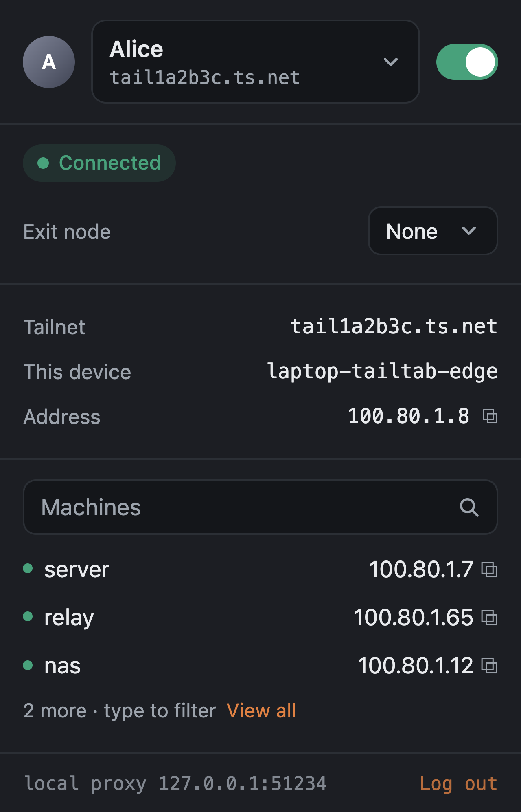
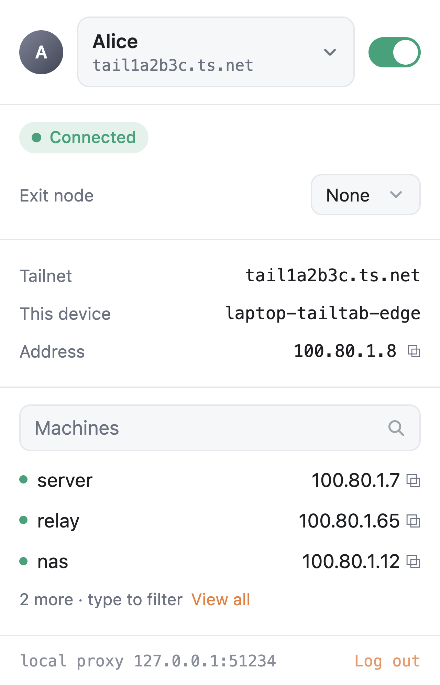
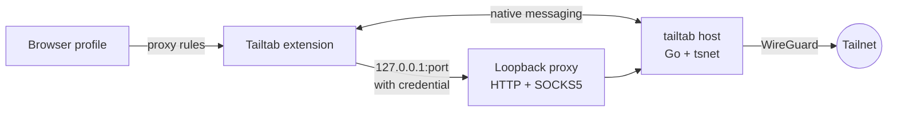
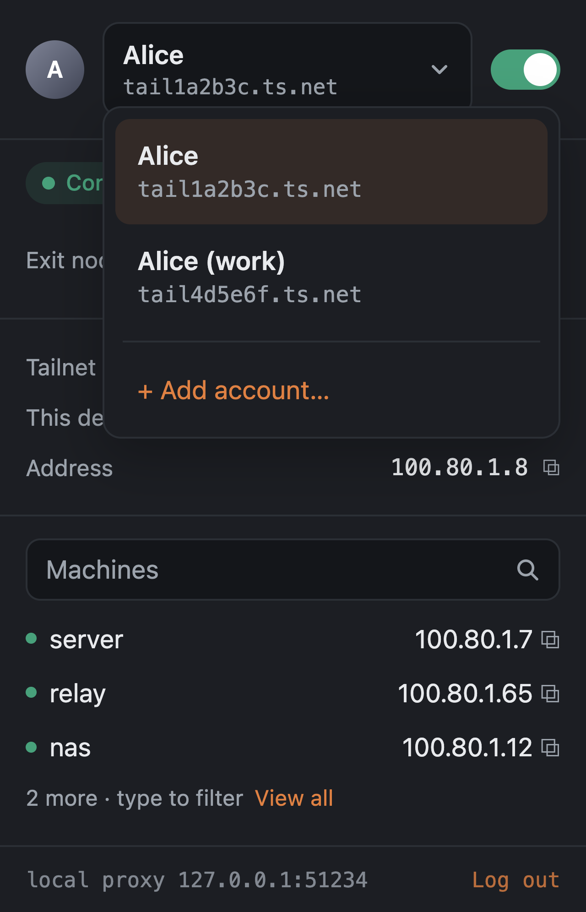
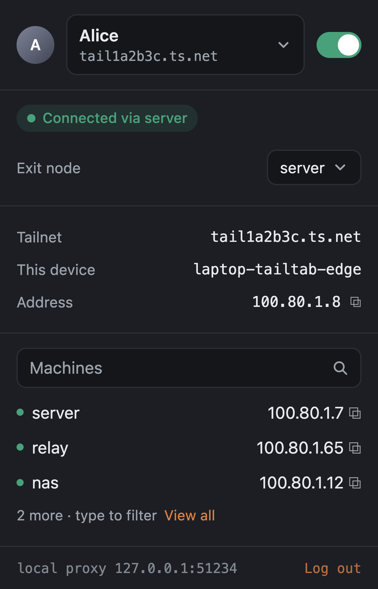
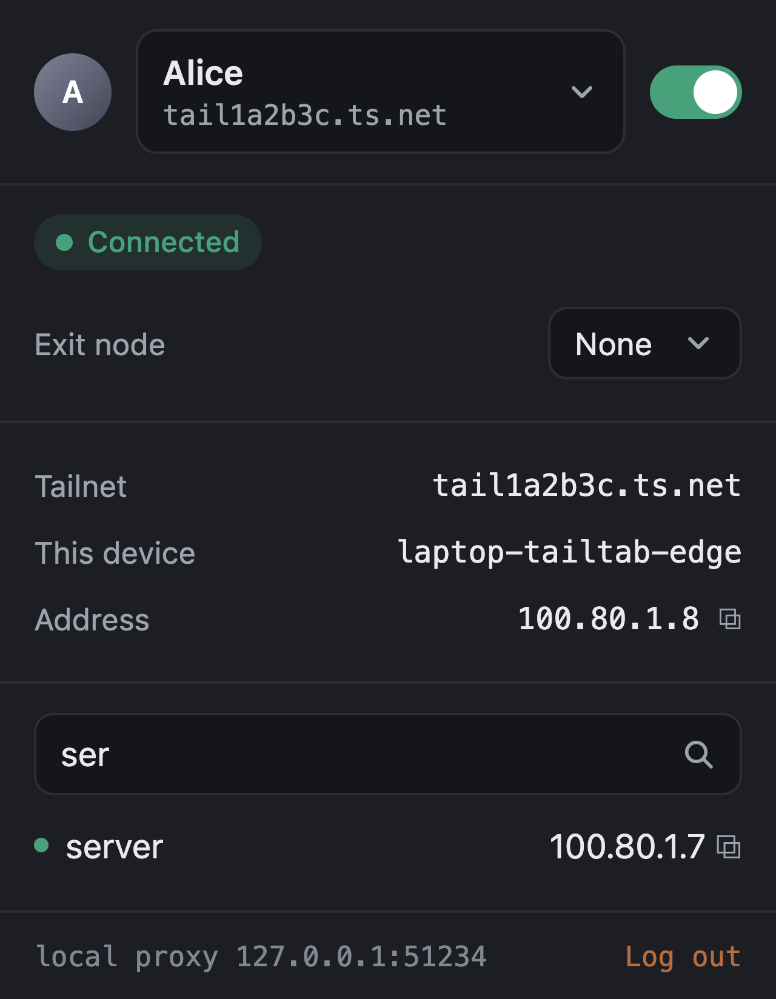

<h1 align="center">Tailtab</h1>

<p align="center">
  A Tailscale node for each browser profile. No system-wide VPN, no root, and two profiles can sit on two different tailnets at once.
</p>

<p align="center">
  <a href="https://github.com/Stocist/Tailtab/actions/workflows/ci.yml"></a>
  <a href="LICENSE"></a>
  
  
  
  
</p>

<p align="center">
  
  &nbsp;&nbsp;
  
</p>

## What it does

- **One node per browser profile.** Each profile becomes its own machine on the tailnet, named `<host>-tailtab-<browser>`, with its own key and its own state. Nothing else on the computer is touched.
- **Split tunnel by default.** Only tailnet destinations go through Tailtab: MagicDNS names, `*.ts.net`, your tailnet's own suffix, and the `100.64.0.0/10` / `fd7a:115c:a1e0::/48` ranges. Everything else is direct, so ordinary browsing never depends on Tailtab being up.
- **Exit nodes, per profile.** Pick an exit node and *this profile's* whole web traffic leaves through it; the rest of the machine carries on as before. An exit node that goes offline blocks browsing rather than leaking it.
- **Several accounts, one click apart.** Tailscale login profiles inside the node: add a second account, switch between tailnets from the header, no re-login.
- **A proxy only this profile can use.** The loopback listener takes a per-process credential and refuses non-tailnet destinations, so no other program on the machine can borrow the profile's identity.
- **Honest status.** The popup separates "the node is up" from "the browser is routing through it", and says so when they differ.

## How it works



The extension speaks to a small Go host over native messaging. The host embeds `tsnet`, so it *is* the node, and it runs an authenticated HTTP/SOCKS5 proxy on loopback. Chromium is pointed at it with a PAC script; Firefox decides per request. Both use the same rule table, and a shared fixture keeps the two in step. Details in [docs/architecture.md](docs/architecture.md).

## Quick start

Requirements: macOS, Go 1.27, Node 22, and Microsoft Edge or Zen.

```sh
git clone https://github.com/Stocist/Tailtab.git && cd Tailtab
./scripts/build.sh
bin/tailtab install --edge-id kejfineblfbjfolkgjkancapnpknomod --gecko-id tailtab@stocist.dev
```

`build.sh` produces the host binary and one unpacked extension per browser. `install` writes the native-messaging manifests for Edge, Zen/Firefox and Chrome, pointing at that binary; run it again if you move the checkout, and `bin/tailtab uninstall` removes exactly those files.

<details>
<summary><b>Load the extension in Edge</b></summary>

1. `edge://extensions` → turn on **Developer mode** → **Load unpacked** → pick `extension/dist/chromium/`.
2. Confirm the ID reads `kejfineblfbjfolkgjkancapnpknomod` (it is fixed by the key in the manifest).
3. After a rebuild, reload the extension from that page. Edge keeps the old background worker across browser restarts; the popup shows a banner when it is out of date.
</details>

<details>
<summary><b>Load the extension in Zen / Firefox</b></summary>

1. `about:debugging#/runtime/this-firefox` → **Load Temporary Add-on…** → pick `extension/dist/firefox/manifest.json`.
2. For private windows, turn on **Run in Private Windows** for Tailtab in `about:addons`.
3. A temporary add-on is removed when the browser restarts; load it again afterwards. A signed build is on the roadmap.
</details>

Then open the popup and click **Connect**. The Tailscale login page opens in a tab; approve the node and the popup turns to *Connected* with the tailnet, the device name and its address. `http://wiki/` reaches a machine called `wiki` on the tailnet; `https://github.com` goes direct.

## A closer look

<p align="center">
  
  &nbsp;
  
  &nbsp;
  
</p>

- **Accounts** ([docs/accounts.md](docs/accounts.md)) — the header is the switcher. *Add account…* opens a login for a new Tailscale account alongside the existing one; each keeps its own node key and tailnet.
- **Exit nodes** ([docs/exit-nodes.md](docs/exit-nodes.md)) — the picker lists every exit node the tailnet offers. While one is selected the rule flips: public traffic goes through it, loopback and private ranges stay local.
- **Machines** — the first few are listed; type to filter by name or address, click a name to open it, click the address to copy it.

## Security

The full write-up is in [docs/security.md](docs/security.md). In short:

- The proxy requires `tailtab:<token>`, where the token is 32 random bytes generated by the host on every start and held only in the extension's memory. Any other local program gets `407`.
- The host refuses destinations the tailnet does not serve (or, with an exit node active, private address space), so it is a tailnet proxy, not an open forward proxy.
- Edge needs `webRequest`, `webRequestAuthProvider` and `<all_urls>` to answer the proxy's challenge; the handler answers only its own loopback challenger and reads no request content. Zen needs none of that.
- `tsnet` uploads its logs to Tailscale and there is no supported switch to stop it; Tailtab does not work around this.

## Status

Tailtab is an experiment that works well enough for daily use by its author on macOS with Edge and Zen. It is not in any extension store yet.

- [x] Per-profile node, split tunnel, authenticated proxy
- [x] Exit nodes, account switching, machine search
- [ ] Signed Zen build (AMO) and a release with prebuilt binaries
- [ ] Icons
- [ ] Linux and Windows hosts
- [ ] Chrome and Firefox proper (should work; untested)

Known limits are listed in [docs/security.md#known-gaps](docs/security.md#known-gaps).

## Development

```sh
./scripts/test.sh        # gofmt-clean Go, vet, tests, and the extension suite
./scripts/build.sh       # bin/tailtab + extension/dist/{chromium,firefox}
```

The extension suite loads `background.js` and `popup.js` unmodified into a stubbed browser environment with fake timers, so proxy-configuration lifecycle, reconnect backoff, the split-tunnel rules and the popup can all be tested without a browser. The host can be driven by hand: it reads and writes 4-byte little-endian length-prefixed JSON on stdin/stdout.

## Acknowledgements

The idea and the native-messaging shape come from Tailscale's own [ts-browser-ext](https://github.com/tailscale/ts-browser-ext) experiment; two files adapt code from it under the same BSD-3-Clause licence. [Tailchrome](https://github.com/dantraynor/tailchrome) ships a similar design and was useful reading.

## License

[BSD-3-Clause](LICENSE).
