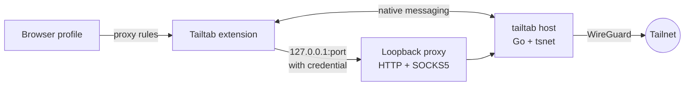

<p align="center">
  
</p>
<h1 align="center">Tailtab</h1>

<p align="center">
  A Tailscale node for each browser profile. No system-wide VPN, no root, and different profiles can sit on completely different tailnets at the same time.
</p>

<p align="center">
  <a href="https://github.com/Stocist/Tailtab/actions/workflows/ci.yml"></a>
  <a href="LICENSE"></a>
  
  
  
  
</p>

<p align="center">
  
  &nbsp;&nbsp;
  
</p>

## What it does

- **One node per browser profile.** Every profile gets its own machine on the tailnet, named `<host>-tailtab-<browser>`, with its own key and state. Nothing else on the computer gets touched.

- **Split tunnel by default.** Only tailnet traffic goes through Tailtab. That includes MagicDNS names, `*.ts.net`, your tailnet's own suffix, the `100.64.0.0/10` / `fd7a:115c:a1e0::/48` ranges, and any subnet a peer routes for the tailnet. Everything else goes out normally, so regular browsing does not depend on Tailtab being connected.

- **Exit nodes per profile.** You can pick an exit node for one browser profile and send that profile's web traffic through it while the rest of the machine carries on normally. If that exit node disappears, Tailtab blocks the traffic instead of silently letting it leak out directly.

- **Multiple Tailscale accounts without constantly logging back in.** Add another account, switch tailnets from the header, and each one keeps its own node key and state.

- **A proxy only that profile can use.** The loopback proxy uses a per-process credential and rejects anything that should not be going through the tailnet. Other programs on the machine cannot just borrow the browser profile's Tailscale identity.

- **Status that actually tells you what is happening.** The popup treats "the node is connected" and "the browser is actually routing through it" as two separate things, because they are. If they do not match, it tells you.

## How it works



The basic setup is pretty simple.

The extension talks to a small Go host through native messaging. That host embeds `tsnet`, which means the host itself becomes the Tailscale node. It then exposes an authenticated HTTP/SOCKS5 proxy over loopback for the browser to use.

Chromium gets pointed at the proxy through a PAC script. Firefox decides whether to proxy each request itself. Both browsers use the same routing rules, with a shared fixture there to make sure the implementations do not slowly drift apart.

More detail is in [docs/architecture.md](docs/architecture.md).

## Quick start

You will need macOS, Go 1.27, Node 22, and either Microsoft Edge or Zen.

```sh
git clone https://github.com/Stocist/Tailtab.git && cd Tailtab
./scripts/build.sh
bin/tailtab install --edge-id kejfineblfbjfolkgjkancapnpknomod --gecko-id tailtab@stocist.dev
```

`build.sh` builds the host binary and an unpacked extension for each browser.

`install` then writes the native-messaging manifests for Edge, Zen/Firefox and Chrome, pointing them at that binary.

If you move the repo afterwards, just run `install` again. `bin/tailtab uninstall` removes the files Tailtab added.

<details>
<summary><b>Load the extension in Edge</b></summary>

1. Open `edge://extensions`.
2. Turn on **Developer mode**.
3. Click **Load unpacked** and select `extension/dist/chromium/`.
4. Check that the extension ID is `kejfineblfbjfolkgjkancapnpknomod`. This is fixed by the key in the manifest.
5. After rebuilding Tailtab, reload the extension from this page.

Edge likes to keep the old background worker around even after the browser restarts, so the popup shows a warning if the extension and host are out of sync.

</details>

<details>
<summary><b>Load the extension in Zen / Firefox</b></summary>

1. Open `about:debugging#/runtime/this-firefox`.
2. Click **Load Temporary Add-on…**.
3. Select `extension/dist/firefox/manifest.json`.
4. If you want Tailtab in private windows, enable **Run in Private Windows** from `about:addons`.

Firefox removes temporary extensions when the browser closes, so you will need to load it again after a restart for now. A signed build is on the roadmap.

</details>

Once that is done, open the popup and hit **Connect**.

Tailtab opens the normal Tailscale login page in a tab. Approve the node and the popup should switch to *Connected*, showing the tailnet, device name and assigned address.

From there:

`http://wiki/` can reach a machine called `wiki` on your tailnet.

`https://github.com` still goes straight to the internet.

That is basically the idea.

## A closer look

<p align="center">
  
  &nbsp;
  
  &nbsp;
  
</p>

- **Accounts** ([docs/accounts.md](docs/accounts.md))  
  The header doubles as the account switcher. *Add account…* starts a login for another Tailscale account without replacing the current one. Each account keeps its own node key, state and tailnet.

- **Exit nodes** ([docs/exit-nodes.md](docs/exit-nodes.md))  
  The picker shows the exit nodes available on the current tailnet. Once one is selected, public traffic from that browser profile goes through it while loopback and private ranges stay local.

- **Machines**  
  Tailtab shows the first few machines on the tailnet and lets you search by name or address. Click a machine name to open it, or click its address to copy it.

## Security

There is a more complete write-up in [docs/security.md](docs/security.md), but the important bits are:

- The proxy requires `tailtab:<token>`. The token is 32 random bytes generated by the host every time it starts and is only kept in the extension's memory. Anything else trying to use the proxy gets `407`.

- The host rejects destinations the tailnet cannot serve. If an exit node is active, private address space is still kept local. The idea is for this to stay a Tailscale-specific proxy rather than becoming a generic forward proxy sitting on localhost.

- Edge needs `webRequest`, `webRequestAuthProvider` and `<all_urls>` so it can answer the proxy authentication challenge. The handler only answers Tailtab's own loopback proxy and does not read the contents of requests. Zen does not need these permissions.

- `tsnet` uploads its own logs to Tailscale and there is currently no supported switch for disabling that. Tailtab does not try to hack around it.

## Status

Tailtab is still experimental, but it is at the point where I can actually daily drive it on macOS with Edge and Zen.

It is not in an extension store yet, so setup is still manual.

- [x] Per-profile node
- [x] Split tunnelling
- [x] Authenticated local proxy
- [x] Exit nodes
- [x] Account switching
- [x] Machine search
- [ ] Signed Zen build through AMO
- [ ] Release builds with prebuilt binaries
- [x] Icons
- [ ] Linux host
- [ ] Windows host
- [ ] Proper Chrome testing
- [ ] Proper Firefox testing

Chrome and Firefox should work with the existing implementations, but I have not properly tested them yet.

Known limitations and security gaps are tracked in [docs/security.md#known-gaps](docs/security.md#known-gaps).

## Development

```sh
./scripts/test.sh        # gofmt-clean Go, vet, tests, and the extension suite
./scripts/build.sh       # bin/tailtab + extension/dist/{chromium,firefox}
```

The extension tests load `background.js` and `popup.js` as-is into a stubbed browser environment with fake timers.

That lets the test suite cover things like proxy setup and teardown, reconnect backoff, split-tunnel routing and popup behaviour without needing to launch a real browser every time.

The host can also be driven manually. Native messaging is just 4-byte little-endian length-prefixed JSON over stdin/stdout.

## Acknowledgements

The original idea and native-messaging structure are based on Tailscale's own [ts-browser-ext](https://github.com/tailscale/ts-browser-ext) experiment. Two files adapt code from it under the same BSD-3-Clause licence.

[tailchrome](https://github.com/dantraynor/tailchrome) takes a similar approach and was also useful to look through while building this.

## License

[BSD-3-Clause](LICENSE).